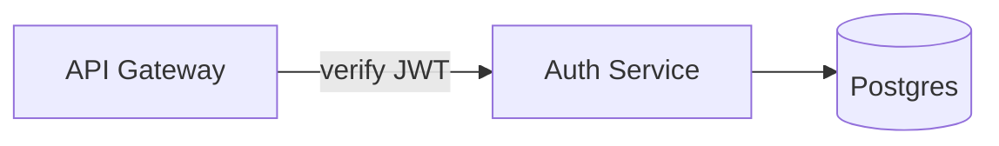

# Docent

> A docent walks you through the museum. This one walks humans — and AI agents — through your architecture.

**Docent** is a presentation, semantics, and agent-control layer wrapped around self-hosted
[Excalidraw](https://github.com/excalidraw/excalidraw). One diagram, three audiences:

- **Humans watching** — a continuous Prezi-style camera glides through your diagram. No slide cuts. One unbroken take.
- **AI reading** — a token-efficient semantic export (Mermaid + compact JSON) that models parse natively.
- **AI driving** — an MCP server that lets agents tour you through the canvas: move the camera, spotlight components, and pulse data flows along arrows in real time.

Docent is a **wrapper, never a fork**. Excalidraw stays upstream and pinned; everything Docent adds lives beside it.

---

## Why

Architecture diagrams fail twice. They bore humans (static walls of boxes) and they blind AI
(pixels, or JSON that is 70% rendering noise). Docent fixes both directions with one primitive:
a **semantic scene graph** with stable IDs. Humans get cinematography over it; agents get an
address space into it.

The demo that explains everything:

> *"Claude, walk me through what happens when a request hits the API."*
>
> The camera glides to the ingress. The gateway glows. A pulse of light travels the arrow into
> the auth service, then fans out along the write path — while the agent narrates each hop.

---

## Features

### 🎥 Longtake presentations
- Excalidraw **frames become waypoints**; ordering by frame name or a sidecar manifest.
- Continuous camera: pan/zoom tweens with easing between waypoints — dive into a frame, pull back to the whole canvas, glide to the next.
- Keyboard-driven presenting (next / prev / overview), shareable as a self-hosted URL.
- The hand-drawn roughjs aesthetic does the charm; Docent does the motion.

### 📦 Semantic export
- Resolves arrow `startBinding`/`endBinding` into an explicit **node/edge graph** — connections as data, not pixels.
- **Legend-aware stripping**: styling your legend maps to meaning is *converted* (`dashed` → `channel: async`), styling it doesn't map is stripped as noise — roughly **70% fewer tokens** than raw `.excalidraw` JSON, with zero meaning lost. Styling is only noise if the legend says so.
- Emits **Mermaid** as the primary AI-facing format, plus a **compact JSON sidecar** carrying what Mermaid can't (spatial layout, frames, groups, intent).
- **Provenance on every fact**: `explicit` (read from the drawing) · `declared` (author-stated intent) · `inferred` (heuristics, e.g. proximity-resolved arrows). The consuming model always knows whether it's reading the diagram, your recorded intent, or a guess — and the export never silently guesses.
- Deterministic: the same scene always produces byte-identical output.
- **Completeness is measured, not asserted**: every fixture scene ships a question bank (structural + intentional), and CI scores a model's answers given only the export. See CONSTITUTION.md Q6.

### 🧭 Intent capture
A diagram's *meaning* isn't in its data model — why an arrow is dashed, why a box is red, what a cluster of services means lives in the author's head. Docent gives intent a place to live at authoring time, all fork-free:
- **Legend editor** — declare your conventions as data: `dashed → async`, `red → hot-path`, `cylinder → datastore`. The exporter applies them.
- **Element annotations** — tags and free-text notes on any element ("rate-limited at edge", "legacy — kill in Q3"), stored in Excalidraw's `customData`.
- **Frame narratives** — one or two sentences per frame: "what this section means." The same text is the **single source of truth** for both the semantic export and the agent's `tour` narration. Capture once, serve both audiences.

### 🤖 Agent-drivable canvas
- A local **MCP server** exposes the Command API. Any MCP client (Claude, or your own harness) can:
  - `get_scene_graph` — read the diagram as nodes/edges/frames with stable IDs
  - `focus` — tween the camera to any element or frame
  - `highlight` — glow / spotlight / dim-others on any set of components
  - `flow` — animate a light pulse along one arrow or a chained multi-hop path
  - `tour` — run a full narrated sequence of the above
- Agents operate purely in **ID-space**. They never address pixels, never touch Excalidraw internals.
- All effects render on a **non-destructive overlay** — the document is never mutated, undo history stays clean.

---

## Architecture

```
┌──────────────────────────────────────────────────────┐
│                     Docent Shell                     │
│                                                      │
│   ┌────────────────┐        ┌─────────────────────┐  │
│   │  Camera Engine │        │  Overlay Renderer   │  │
│   │ (tweens, tours)│        │ (highlight, flow FX)│  │
│   └───────┬────────┘        └──────────┬──────────┘  │
│           │                            │             │
│   ┌───────┴────────────────────────────┴──────────┐  │
│   │           Command API  (ID-space)             │  │
│   │   focus · highlight · flow · tour · narrate   │  │
│   └───────┬───────────────────────────┬───────────┘  │
│           │                           │              │
│   ┌───────┴────────┐         ┌────────┴───────┐      │
│   │  Scene Graph   │         │   MCP Server   │      │
│   │  + Exporters   │         │ (local, stdio/ │      │
│   │ (Mermaid/JSON) │         │   websocket)   │      │
│   └───────┬────────┘         └────────────────┘      │
│           │                                          │
│   ┌───────┴──────────────────────────────────────┐   │
│   │      @excalidraw/excalidraw  (pinned)        │   │
│   └──────────────────────────────────────────────┘   │
└──────────────────────────────────────────────────────┘
```

**The five subsystems:**

1. **Shell** — a thin React app embedding the Excalidraw component; owns `excalidrawAPI`.
2. **Scene Graph** — parses the live scene into `{nodes, edges, frames, groups}` with stable IDs; feeds both exporters and the Command API. This is the shared address space.
3. **Camera Engine** — viewport tweening over `scrollX/scrollY/zoom` with easing; consumed by presentation mode and agent `focus`/`tour` commands alike.
4. **Overlay Renderer** — a viewport-synced SVG layer above the canvas. All highlights and flow pulses render here. It never writes to the document.
5. **MCP Server** — exposes the Command API to agents; also serves the semantic export.

---

## Command API

```jsonc
get_scene_graph()
// → { nodes: [...], edges: [...], frames: [...] }  — stable IDs, current state

focus({ id: "n_auth", padding?: 0.2 })
// camera tweens to the element/frame's bounds

highlight({ ids: ["n_auth", "n_db"], style: "spotlight" })
// styles: "glow" | "spotlight" (dim everything else) | "outline"
// idempotent; clear with highlight({ ids: [] })

flow({ path: ["e_12", "e_15", "e_19"], speed?: 1.0, loop?: false })
// a pulse travels each edge end-to-end, in order — multi-hop request tracing

tour({ steps: [ { focus: "f_ingress", narrate: "Requests land here…" }, ... ] })
// runs a full narrated walkthrough; interruptible

narrate({ text: "..." })
// renders in the narration panel
```

Unknown IDs return explicit errors — commands never silently no-op.

---

## Export format

**Mermaid (primary, AI-facing):**



**Compact JSON sidecar (spatial + structural context):**

```json
{
  "docent": 1,
  "legend": {
    "stroke.dashed": "channel: async",
    "color.red": "tag: hot-path",
    "shape.cylinder": "kind: datastore"
  },
  "nodes": [
    { "id": "n_api",  "label": "API Gateway",  "shape": "rectangle", "frame": "f_ingress",
      "tags": ["hot-path"], "note": "rate-limited at edge", "provenance": { "tags": "declared", "note": "declared" } },
    { "id": "n_auth", "label": "Auth Service", "shape": "rectangle", "frame": "f_core" },
    { "id": "n_db",   "label": "Postgres",     "kind": "datastore",  "frame": "f_core" }
  ],
  "edges": [
    { "id": "e_12", "from": "n_api",  "to": "n_auth", "label": "verify JWT", "channel": "async",
      "provenance": { "link": "explicit", "channel": "declared" } },
    { "id": "e_15", "from": "n_auth", "to": "n_db",
      "provenance": { "link": "inferred" } }
  ],
  "frames": [
    { "id": "f_ingress", "name": "01 Ingress", "narrative": "All external traffic lands here; the gateway terminates TLS and rate-limits before anything touches core." },
    { "id": "f_core",    "name": "02 Core" }
  ]
}
```

Provenance levels: `explicit` — read from the drawing · `declared` — author-stated via legend/annotations/narratives · `inferred` — heuristic, never presented as fact.

---

## Quick start

```bash
# self-host
docker compose up
# → http://localhost:3000  (canvas)
# → MCP server on stdio / ws://localhost:3001

# or dev mode
pnpm install
pnpm dev
```

Point your MCP client at the Docent server, ask it to `get_scene_graph`, and start touring.

---

## Roadmap (scope-locked — see CONSTITUTION.md)

| Milestone | Deliverable | Definition of done |
|-----------|-------------|--------------------|
| **M0 — Shell** | Self-hosted canvas | Docker one-command up; Excalidraw pinned; load/save `.excalidraw` files |
| **M1 — Longtake** | Presentation mode | Frames-as-waypoints; eased camera tweens; keyboard controls; overview mode |
| **M2 — Scene Graph + Intent + Export** | Semantic layer | Deterministic graph extraction; legend editor, element annotations (`customData`), frame narratives; Mermaid + JSON emitters with legend application and full provenance; token-reduction and round-trip comprehension measured in CI |
| **M3 — Overlay FX** | Highlight + flow | Viewport-synced overlay; glow/spotlight/dim; flow pulse on straight + curved arrows; elbow-arrow path parity |
| **M4 — Agent control** | MCP server | Full Command API over MCP; narrated `tour`; the end-to-end demo |

**v2 (explicitly deferred):** agent *authoring* — creating and mutating diagram elements via the
Command API. v1 agents read and drive; they don't draw. The scene graph is designed so `add_node`
/ `add_edge` slot in without rework.

## Non-goals

Locked out of scope — see CONSTITUTION.md for rationale:

- Forking or patching Excalidraw core
- Multiplayer / real-time collaboration
- Auth, accounts, multi-tenancy (single-user self-host)
- Prezi-style viewport *rotation*
- Pixel-perfect tracing of roughjs strokes
- TTS narration, mobile support, custom element types

---

## Design decisions (locked)

1. **Wrapper, never fork.** Upstream pinned; upgrades are deliberate events.
2. **Overlay is non-destructive.** Visual effects never mutate the scene or undo history.
3. **Neon-over-pencil.** Flow pulses render as a wider soft glow *over* the sketchy stroke — deliberately not tracing roughjs jitter. It reads better and stays robust to upstream rendering changes.
4. **Path-math parity.** Curved and elbow arrows replicate Excalidraw's path construction from `element.points` + roundness — no naive point-connecting.
5. **ID-space agent surface.** Agents reference scene-graph IDs only; unknown IDs fail loudly.
6. **Deterministic export.** Stable ordering, sorted keys, full provenance.
7. **Legend-as-data.** Declared style→meaning mappings are applied by the exporter; unmapped styling is stripped. Styling is only noise if the legend says so.
8. **Intent is captured, never guessed.** Meaning enters through the legend, `customData` annotations, and frame narratives at authoring time — it is not recoverable from the data model afterward. Narratives are the single source for both export and tour narration.
9. **Completeness = round-trip comprehension.** "The export carries the diagram's meaning" is defined by a scored question bank in CI (CONSTITUTION.md Q6) — measured, not asserted.

---

## License

MIT. Docent embeds [Excalidraw](https://github.com/excalidraw/excalidraw) (MIT © Excalidraw contributors) as an npm dependency — their notice travels with the package.# Docent

> A docent walks you through the museum. This one walks humans — and AI agents — through your architecture.

**Docent** is a presentation, semantics, and agent-control layer wrapped around self-hosted
[Excalidraw](https://github.com/excalidraw/excalidraw). One diagram, three audiences:

- **Humans watching** — a continuous Prezi-style camera glides through your diagram. No slide cuts. One unbroken take.
- **AI reading** — a token-efficient semantic export (Mermaid + compact JSON) that models parse natively.
- **AI driving** — an MCP server that lets agents tour you through the canvas: move the camera, spotlight components, and pulse data flows along arrows in real time.

Docent is a **wrapper, never a fork**. Excalidraw stays upstream and pinned; everything Docent adds lives beside it.

---

## Why

Architecture diagrams fail twice. They bore humans (static walls of boxes) and they blind AI
(pixels, or JSON that is 70% rendering noise). Docent fixes both directions with one primitive:
a **semantic scene graph** with stable IDs. Humans get cinematography over it; agents get an
address space into it.

The demo that explains everything:

> *"Claude, walk me through what happens when a request hits the API."*
>
> The camera glides to the ingress. The gateway glows. A pulse of light travels the arrow into
> the auth service, then fans out along the write path — while the agent narrates each hop.

---

## Features

### 🎥 Longtake presentations
- Excalidraw **frames become waypoints**; ordering by frame name or a sidecar manifest.
- Continuous camera: pan/zoom tweens with easing between waypoints — dive into a frame, pull back to the whole canvas, glide to the next.
- Keyboard-driven presenting (next / prev / overview), shareable as a self-hosted URL.
- The hand-drawn roughjs aesthetic does the charm; Docent does the motion.

### 📦 Semantic export
- Resolves arrow `startBinding`/`endBinding` into an explicit **node/edge graph** — connections as data, not pixels.
- **Legend-aware stripping**: styling your legend maps to meaning is *converted* (`dashed` → `channel: async`), styling it doesn't map is stripped as noise — roughly **70% fewer tokens** than raw `.excalidraw` JSON, with zero meaning lost. Styling is only noise if the legend says so.
- Emits **Mermaid** as the primary AI-facing format, plus a **compact JSON sidecar** carrying what Mermaid can't (spatial layout, frames, groups, intent).
- **Provenance on every fact**: `explicit` (read from the drawing) · `declared` (author-stated intent) · `inferred` (heuristics, e.g. proximity-resolved arrows). The consuming model always knows whether it's reading the diagram, your recorded intent, or a guess — and the export never silently guesses.
- Deterministic: the same scene always produces byte-identical output.
- **Completeness is measured, not asserted**: every fixture scene ships a question bank (structural + intentional), and CI scores a model's answers given only the export. See CONSTITUTION.md Q6.

### 🧭 Intent capture
A diagram's *meaning* isn't in its data model — why an arrow is dashed, why a box is red, what a cluster of services means lives in the author's head. Docent gives intent a place to live at authoring time, all fork-free:
- **Legend editor** — declare your conventions as data: `dashed → async`, `red → hot-path`, `cylinder → datastore`. The exporter applies them.
- **Element annotations** — tags and free-text notes on any element ("rate-limited at edge", "legacy — kill in Q3"), stored in Excalidraw's `customData`.
- **Frame narratives** — one or two sentences per frame: "what this section means." The same text is the **single source of truth** for both the semantic export and the agent's `tour` narration. Capture once, serve both audiences.

### 🤖 Agent-drivable canvas
- A local **MCP server** exposes the Command API. Any MCP client (Claude, or your own harness) can:
  - `get_scene_graph` — read the diagram as nodes/edges/frames with stable IDs
  - `focus` — tween the camera to any element or frame
  - `highlight` — glow / spotlight / dim-others on any set of components
  - `flow` — animate a light pulse along one arrow or a chained multi-hop path
  - `tour` — run a full narrated sequence of the above
- Agents operate purely in **ID-space**. They never address pixels, never touch Excalidraw internals.
- All effects render on a **non-destructive overlay** — the document is never mutated, undo history stays clean.

---

## Architecture

```
┌──────────────────────────────────────────────────────┐
│                     Docent Shell                     │
│                                                      │
│   ┌────────────────┐        ┌─────────────────────┐  │
│   │  Camera Engine │        │  Overlay Renderer   │  │
│   │ (tweens, tours)│        │ (highlight, flow FX)│  │
│   └───────┬────────┘        └──────────┬──────────┘  │
│           │                            │             │
│   ┌───────┴────────────────────────────┴──────────┐  │
│   │           Command API  (ID-space)             │  │
│   │   focus · highlight · flow · tour · narrate   │  │
│   └───────┬───────────────────────────┬───────────┘  │
│           │                           │              │
│   ┌───────┴────────┐         ┌────────┴───────┐      │
│   │  Scene Graph   │         │   MCP Server   │      │
│   │  + Exporters   │         │ (local, stdio/ │      │
│   │ (Mermaid/JSON) │         │   websocket)   │      │
│   └───────┬────────┘         └────────────────┘      │
│           │                                          │
│   ┌───────┴──────────────────────────────────────┐   │
│   │      @excalidraw/excalidraw  (pinned)        │   │
│   └──────────────────────────────────────────────┘   │
└──────────────────────────────────────────────────────┘
```

**The five subsystems:**

1. **Shell** — a thin React app embedding the Excalidraw component; owns `excalidrawAPI`.
2. **Scene Graph** — parses the live scene into `{nodes, edges, frames, groups}` with stable IDs; feeds both exporters and the Command API. This is the shared address space.
3. **Camera Engine** — viewport tweening over `scrollX/scrollY/zoom` with easing; consumed by presentation mode and agent `focus`/`tour` commands alike.
4. **Overlay Renderer** — a viewport-synced SVG layer above the canvas. All highlights and flow pulses render here. It never writes to the document.
5. **MCP Server** — exposes the Command API to agents; also serves the semantic export.

---

## Command API

```jsonc
get_scene_graph()
// → { nodes: [...], edges: [...], frames: [...] }  — stable IDs, current state

focus({ id: "n_auth", padding?: 0.2 })
// camera tweens to the element/frame's bounds

highlight({ ids: ["n_auth", "n_db"], style: "spotlight" })
// styles: "glow" | "spotlight" (dim everything else) | "outline"
// idempotent; clear with highlight({ ids: [] })

flow({ path: ["e_12", "e_15", "e_19"], speed?: 1.0, loop?: false })
// a pulse travels each edge end-to-end, in order — multi-hop request tracing

tour({ steps: [ { focus: "f_ingress", narrate: "Requests land here…" }, ... ] })
// runs a full narrated walkthrough; interruptible

narrate({ text: "..." })
// renders in the narration panel
```

Unknown IDs return explicit errors — commands never silently no-op.

---

## Export format

**Mermaid (primary, AI-facing):**


**Compact JSON sidecar (spatial + structural context):**

```json
{
  "docent": 1,
  "legend": {
    "stroke.dashed": "channel: async",
    "color.red": "tag: hot-path",
    "shape.cylinder": "kind: datastore"
  },
  "nodes": [
    { "id": "n_api",  "label": "API Gateway",  "shape": "rectangle", "frame": "f_ingress",
      "tags": ["hot-path"], "note": "rate-limited at edge", "provenance": { "tags": "declared", "note": "declared" } },
    { "id": "n_auth", "label": "Auth Service", "shape": "rectangle", "frame": "f_core" },
    { "id": "n_db",   "label": "Postgres",     "kind": "datastore",  "frame": "f_core" }
  ],
  "edges": [
    { "id": "e_12", "from": "n_api",  "to": "n_auth", "label": "verify JWT", "channel": "async",
      "provenance": { "link": "explicit", "channel": "declared" } },
    { "id": "e_15", "from": "n_auth", "to": "n_db",
      "provenance": { "link": "inferred" } }
  ],
  "frames": [
    { "id": "f_ingress", "name": "01 Ingress", "narrative": "All external traffic lands here; the gateway terminates TLS and rate-limits before anything touches core." },
    { "id": "f_core",    "name": "02 Core" }
  ]
}
```

Provenance levels: `explicit` — read from the drawing · `declared` — author-stated via legend/annotations/narratives · `inferred` — heuristic, never presented as fact.

---

## Quick start

```bash
# self-host
docker compose up
# → http://localhost:3000  (canvas)
# → MCP server on stdio / ws://localhost:3001

# or dev mode
pnpm install
pnpm dev
```

Point your MCP client at the Docent server, ask it to `get_scene_graph`, and start touring.

---

## Roadmap (scope-locked — see CONSTITUTION.md)

| Milestone | Deliverable | Definition of done |
|-----------|-------------|--------------------|
| **M0 — Shell** | Self-hosted canvas | Docker one-command up; Excalidraw pinned; load/save `.excalidraw` files |
| **M1 — Longtake** | Presentation mode | Frames-as-waypoints; eased camera tweens; keyboard controls; overview mode |
| **M2 — Scene Graph + Intent + Export** | Semantic layer | Deterministic graph extraction; legend editor, element annotations (`customData`), frame narratives; Mermaid + JSON emitters with legend application and full provenance; token-reduction and round-trip comprehension measured in CI |
| **M3 — Overlay FX** | Highlight + flow | Viewport-synced overlay; glow/spotlight/dim; flow pulse on straight + curved arrows; elbow-arrow path parity |
| **M4 — Agent control** | MCP server | Full Command API over MCP; narrated `tour`; the end-to-end demo |

**v2 (explicitly deferred):** agent *authoring* — creating and mutating diagram elements via the
Command API. v1 agents read and drive; they don't draw. The scene graph is designed so `add_node`
/ `add_edge` slot in without rework.

## Non-goals

Locked out of scope — see CONSTITUTION.md for rationale:

- Forking or patching Excalidraw core
- Multiplayer / real-time collaboration
- Auth, accounts, multi-tenancy (single-user self-host)
- Prezi-style viewport *rotation*
- Pixel-perfect tracing of roughjs strokes
- TTS narration, mobile support, custom element types

---

## Design decisions (locked)

1. **Wrapper, never fork.** Upstream pinned; upgrades are deliberate events.
2. **Overlay is non-destructive.** Visual effects never mutate the scene or undo history.
3. **Neon-over-pencil.** Flow pulses render as a wider soft glow *over* the sketchy stroke — deliberately not tracing roughjs jitter. It reads better and stays robust to upstream rendering changes.
4. **Path-math parity.** Curved and elbow arrows replicate Excalidraw's path construction from `element.points` + roundness — no naive point-connecting.
5. **ID-space agent surface.** Agents reference scene-graph IDs only; unknown IDs fail loudly.
6. **Deterministic export.** Stable ordering, sorted keys, full provenance.
7. **Legend-as-data.** Declared style→meaning mappings are applied by the exporter; unmapped styling is stripped. Styling is only noise if the legend says so.
8. **Intent is captured, never guessed.** Meaning enters through the legend, `customData` annotations, and frame narratives at authoring time — it is not recoverable from the data model afterward. Narratives are the single source for both export and tour narration.
9. **Completeness = round-trip comprehension.** "The export carries the diagram's meaning" is defined by a scored question bank in CI (CONSTITUTION.md Q6) — measured, not asserted.

---

## License

MIT. Docent embeds [Excalidraw](https://github.com/excalidraw/excalidraw) (MIT © Excalidraw contributors) as an npm dependency — their notice travels with the package.# Docent

> A docent walks you through the museum. This one walks humans — and AI agents — through your architecture.

**Docent** is a presentation, semantics, and agent-control layer wrapped around self-hosted
[Excalidraw](https://github.com/excalidraw/excalidraw). One diagram, three audiences:

- **Humans watching** — a continuous Prezi-style camera glides through your diagram. No slide cuts. One unbroken take.
- **AI reading** — a token-efficient semantic export (Mermaid + compact JSON) that models parse natively.
- **AI driving** — an MCP server that lets agents tour you through the canvas: move the camera, spotlight components, and pulse data flows along arrows in real time.

Docent is a **wrapper, never a fork**. Excalidraw stays upstream and pinned; everything Docent adds lives beside it.

---

## Why

Architecture diagrams fail twice. They bore humans (static walls of boxes) and they blind AI
(pixels, or JSON that is 70% rendering noise). Docent fixes both directions with one primitive:
a **semantic scene graph** with stable IDs. Humans get cinematography over it; agents get an
address space into it.

The demo that explains everything:

> *"Claude, walk me through what happens when a request hits the API."*
>
> The camera glides to the ingress. The gateway glows. A pulse of light travels the arrow into
> the auth service, then fans out along the write path — while the agent narrates each hop.

---

## Features

### 🎥 Longtake presentations
- Excalidraw **frames become waypoints**; ordering by frame name or a sidecar manifest.
- Continuous camera: pan/zoom tweens with easing between waypoints — dive into a frame, pull back to the whole canvas, glide to the next.
- Keyboard-driven presenting (next / prev / overview), shareable as a self-hosted URL.
- The hand-drawn roughjs aesthetic does the charm; Docent does the motion.

### 📦 Semantic export
- Resolves arrow `startBinding`/`endBinding` into an explicit **node/edge graph** — connections as data, not pixels.
- Strips rendering noise (seeds, nonces, stroke styling, timestamps): roughly **70% fewer tokens** than raw `.excalidraw` JSON.
- Emits **Mermaid** as the primary AI-facing format, plus a **compact JSON sidecar** carrying what Mermaid can't (spatial layout, frames, groups).
- Unbound arrows (drawn near, not snapped) are resolved by a proximity heuristic and **flagged as `inferred`** — the export never silently guesses.
- Deterministic: the same scene always produces byte-identical output.

### 🤖 Agent-drivable canvas
- A local **MCP server** exposes the Command API. Any MCP client (Claude, or your own harness) can:
  - `get_scene_graph` — read the diagram as nodes/edges/frames with stable IDs
  - `focus` — tween the camera to any element or frame
  - `highlight` — glow / spotlight / dim-others on any set of components
  - `flow` — animate a light pulse along one arrow or a chained multi-hop path
  - `tour` — run a full narrated sequence of the above
- Agents operate purely in **ID-space**. They never address pixels, never touch Excalidraw internals.
- All effects render on a **non-destructive overlay** — the document is never mutated, undo history stays clean.

---

## Architecture

```
┌──────────────────────────────────────────────────────┐
│                     Docent Shell                     │
│                                                      │
│   ┌────────────────┐        ┌─────────────────────┐  │
│   │  Camera Engine │        │  Overlay Renderer   │  │
│   │ (tweens, tours)│        │ (highlight, flow FX)│  │
│   └───────┬────────┘        └──────────┬──────────┘  │
│           │                            │             │
│   ┌───────┴────────────────────────────┴──────────┐  │
│   │           Command API  (ID-space)             │  │
│   │   focus · highlight · flow · tour · narrate   │  │
│   └───────┬───────────────────────────┬───────────┘  │
│           │                           │              │
│   ┌───────┴────────┐         ┌────────┴───────┐      │
│   │  Scene Graph   │         │   MCP Server   │      │
│   │  + Exporters   │         │ (local, stdio/ │      │
│   │ (Mermaid/JSON) │         │   websocket)   │      │
│   └───────┬────────┘         └────────────────┘      │
│           │                                          │
│   ┌───────┴──────────────────────────────────────┐   │
│   │      @excalidraw/excalidraw  (pinned)        │   │
│   └──────────────────────────────────────────────┘   │
└──────────────────────────────────────────────────────┘
```

**The five subsystems:**

1. **Shell** — a thin React app embedding the Excalidraw component; owns `excalidrawAPI`.
2. **Scene Graph** — parses the live scene into `{nodes, edges, frames, groups}` with stable IDs; feeds both exporters and the Command API. This is the shared address space.
3. **Camera Engine** — viewport tweening over `scrollX/scrollY/zoom` with easing; consumed by presentation mode and agent `focus`/`tour` commands alike.
4. **Overlay Renderer** — a viewport-synced SVG layer above the canvas. All highlights and flow pulses render here. It never writes to the document.
5. **MCP Server** — exposes the Command API to agents; also serves the semantic export.

---

## Command API

```jsonc
get_scene_graph()
// → { nodes: [...], edges: [...], frames: [...] }  — stable IDs, current state

focus({ id: "n_auth", padding?: 0.2 })
// camera tweens to the element/frame's bounds

highlight({ ids: ["n_auth", "n_db"], style: "spotlight" })
// styles: "glow" | "spotlight" (dim everything else) | "outline"
// idempotent; clear with highlight({ ids: [] })

flow({ path: ["e_12", "e_15", "e_19"], speed?: 1.0, loop?: false })
// a pulse travels each edge end-to-end, in order — multi-hop request tracing

tour({ steps: [ { focus: "f_ingress", narrate: "Requests land here…" }, ... ] })
// runs a full narrated walkthrough; interruptible

narrate({ text: "..." })
// renders in the narration panel
```

Unknown IDs return explicit errors — commands never silently no-op.

---

## Export format

**Mermaid (primary, AI-facing):**


**Compact JSON sidecar (spatial + structural context):**

```json
{
  "docent": 1,
  "nodes": [
    { "id": "n_api",  "label": "API Gateway",  "shape": "rectangle", "frame": "f_ingress" },
    { "id": "n_auth", "label": "Auth Service", "shape": "rectangle", "frame": "f_core" },
    { "id": "n_db",   "label": "Postgres",     "shape": "cylinder",  "frame": "f_core" }
  ],
  "edges": [
    { "id": "e_12", "from": "n_api",  "to": "n_auth", "label": "verify JWT" },
    { "id": "e_15", "from": "n_auth", "to": "n_db",   "binding": "inferred" }
  ],
  "frames": [
    { "id": "f_ingress", "name": "01 Ingress" },
    { "id": "f_core",    "name": "02 Core" }
  ]
}
```

---

## Quick start

```bash
# self-host
docker compose up
# → http://localhost:3000  (canvas)
# → MCP server on stdio / ws://localhost:3001

# or dev mode
pnpm install
pnpm dev
```

Point your MCP client at the Docent server, ask it to `get_scene_graph`, and start touring.

---

## Roadmap (scope-locked — see CONSTITUTION.md)

| Milestone | Deliverable | Definition of done |
|-----------|-------------|--------------------|
| **M0 — Shell** | Self-hosted canvas | Docker one-command up; Excalidraw pinned; load/save `.excalidraw` files |
| **M1 — Longtake** | Presentation mode | Frames-as-waypoints; eased camera tweens; keyboard controls; overview mode |
| **M2 — Scene Graph + Export** | Semantic layer | Deterministic graph extraction; Mermaid + JSON emitters; inferred-binding flags; token-reduction measured |
| **M3 — Overlay FX** | Highlight + flow | Viewport-synced overlay; glow/spotlight/dim; flow pulse on straight + curved arrows; elbow-arrow path parity |
| **M4 — Agent control** | MCP server | Full Command API over MCP; narrated `tour`; the end-to-end demo |

**v2 (explicitly deferred):** agent *authoring* — creating and mutating diagram elements via the
Command API. v1 agents read and drive; they don't draw. The scene graph is designed so `add_node`
/ `add_edge` slot in without rework.

## Non-goals

Locked out of scope — see CONSTITUTION.md for rationale:

- Forking or patching Excalidraw core
- Multiplayer / real-time collaboration
- Auth, accounts, multi-tenancy (single-user self-host)
- Prezi-style viewport *rotation*
- Pixel-perfect tracing of roughjs strokes
- TTS narration, mobile support, custom element types

---

## Design decisions (locked)

1. **Wrapper, never fork.** Upstream pinned; upgrades are deliberate events.
2. **Overlay is non-destructive.** Visual effects never mutate the scene or undo history.
3. **Neon-over-pencil.** Flow pulses render as a wider soft glow *over* the sketchy stroke — deliberately not tracing roughjs jitter. It reads better and stays robust to upstream rendering changes.
4. **Path-math parity.** Curved and elbow arrows replicate Excalidraw's path construction from `element.points` + roundness — no naive point-connecting.
5. **ID-space agent surface.** Agents reference scene-graph IDs only; unknown IDs fail loudly.
6. **Deterministic export.** Stable ordering, sorted keys, flagged inferences.

---

## License

MIT. Docent embeds [Excalidraw](https://github.com/excalidraw/excalidraw) (MIT © Excalidraw contributors) as an npm dependency — their notice travels with the package.
