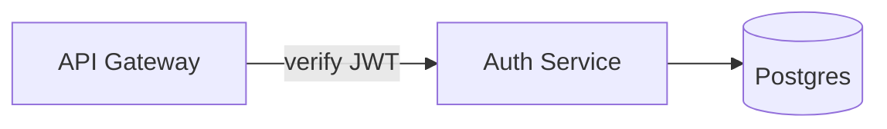

# Docent

> A docent walks you through the museum. This one walks humans — and AI agents — through your architecture.

**Docent** is a presentation, semantics, and agent-control layer wrapped around self-hosted
[Excalidraw](https://github.com/excalidraw/excalidraw). One diagram, three audiences:

- **Humans watching** — a continuous Prezi-style camera glides through your diagram. No slide cuts. One unbroken take.
- **AI reading** — a token-efficient semantic export (Mermaid + compact JSON) that models parse natively.
- **AI driving** — an MCP server that lets agents tour you through the canvas: move the camera, spotlight components, and pulse data flows along arrows in real time.

Docent is a **wrapper, never a fork**. Excalidraw stays upstream and pinned; everything Docent adds lives beside it.

---

## Built on Excalidraw ❤️

Docent is **inspired by and built upon [Excalidraw](https://github.com/excalidraw/excalidraw)**,
the MIT-licensed virtual whiteboard. The canvas you draw on, the hand-sketched
rendering, and the `.excalidraw` file format are Excalidraw's work — Docent embeds
it as a pinned, unmodified dependency and adds a presentation, semantics, and
agent layer *beside* it. Docent's own constitution makes forking or patching
Excalidraw a permanent non-goal (invariant I1).

Full license texts for Excalidraw and every other shipped third-party component
travel with the source and with every distributed artifact in
[THIRD_PARTY_NOTICES.md](THIRD_PARTY_NOTICES.md). Docent is an independent
project, **not affiliated with or endorsed by Excalidraw**. If Docent is useful
to you, consider [supporting Excalidraw](https://plus.excalidraw.com) — the
foundation everything here stands on.

---

## Why

Architecture diagrams fail twice. They bore humans (static walls of boxes) and they blind AI
(pixels, or JSON that is 70% rendering noise). Docent fixes both directions with one primitive:
a **semantic scene graph** with stable IDs. Humans get cinematography over it; agents get an
address space into it.

The demo that explains everything:

> *"Walk me through what happens when a request hits the API."*
>
> The camera glides to the ingress. The gateway glows. A pulse of light travels the arrow into
> the auth service, then fans out along the write path — while the agent narrates each hop.

---

## Features

### 🎥 Longtake presentations
- Excalidraw **frames become waypoints**; ordering by frame name or a sidecar manifest.
- Continuous camera: pan/zoom tweens with easing between waypoints — dive into a frame, pull back to the whole canvas, glide to the next.
- Keyboard-driven presenting (next / prev / overview), shareable as a self-hosted URL.
- The hand-drawn roughjs aesthetic does the charm; Docent does the motion.
- **Controls:** ▶ Present lives in the hamburger menu (as do all Docent actions — the canvas is full-bleed) · `→`/`Space` next · `←` prev · `Home` overview · click a linked component to dive into its detail diagram — components that have one wear a small corner chip (hide them under View / the hamburger if you want a bare canvas) · `⌫` climbs back a tier · `Esc` exits. Selecting elements pops a floating toolbar beside the selection with the contextual actions (⤵/＋ Detail, Glow, Spotlight, Flow on arrows). Load any scene straight into the app with `?scene=<url>` — try `?scene=samples/demo.excalidraw`, or the full-capability tour scene `?scene=samples/showcase.excalidraw` (3 tiers, 9 narrated frames, legend, hot-path, inferred edges).

### 🪆 Tiered drill-down
One canvas, many zoom-levels of meaning — overview → service → component → logic:
- **Click a shape, dive into its inner mechanism.** Any element can declare a *detail diagram* — a frame on the same canvas drawing what's inside it, linked via `customData.docent.detail`. In drill mode, activating the element portals the camera into that frame, Prezi-style; back climbs one tier.
- **Create on first click.** Activating a shape with no detail yet offers to create its detail frame — named after the element, placed in free canvas space, linked, and dived into.
- **Unbounded tiers.** Elements inside a detail frame can declare their own details. The mechanism is element-agnostic: shapes, images, frames, grouped composites.
- **Tiers never bleed into view.** Detail frames live in bands far below Layer 1 (computed from the link graph, spaced adaptively) — reviewing the system diagram shows the system diagram, nothing else. Overview, file-open, and presentation waypoints all scope to Layer 1; lower tiers are reached by diving. Distant bands cost nothing to render (viewport culling).
- **Pop back instantly.** Breadcrumbs derive from the link structure at wherever the camera is — after a dive, ◂ Up restores the exact view you left; after free navigation it climbs one tier and glows the shape you came out of. Works even right after opening a file deep in a tier.
- **Arrange detail tiers** runs automatically on every save (and on demand from the menu), reflowing scattered frames into clean bands — one undoable step; already-tidy scenes are untouched.
- The hierarchy is data, not decoration — it rides the scene graph into both exports (provenance `declared`), so agents can tour tier by tier.
- **Cross-tier edge refinement**: an arrow into a component can declare which *inner* part of that component's detail diagram the traffic actually lands on (select the arrow → "Lands on" picker). `Service A → Broker` stays true at Layer 1, while the export also carries `Service A ⇢ Adapter A (inside Broker)` — as a declared fact in the sidecar and a dotted edge in Mermaid.

### 📦 Semantic export
- Resolves arrow `startBinding`/`endBinding` into an explicit **node/edge graph** — connections as data, not pixels.
- **Library icons read as one component**: an imported shape (AWS, GCP, …) is a group of strokes to the data model but one thing to a reader, so Docent collapses it into a single node — its label, its box, its arrows. Override either way from the selection toolbar (`⧉ Merge` / `⧉ 1 component`); exports flag whether it was inferred or declared.
- **Legend-aware stripping**: styling your legend maps to meaning is *converted* (`dashed` → `channel: async`), styling it doesn't map is stripped as noise — roughly **70% fewer tokens** than raw `.excalidraw` JSON, with zero meaning lost. Styling is only noise if the legend says so.
- Emits **Mermaid** as the primary AI-facing format, plus a **compact JSON sidecar** carrying what Mermaid can't (spatial layout, frames, groups, intent).
- **Right-click a frame** — or a component that has a detail layer — and *Copy semantic JSON* puts that one frame's sidecar on the clipboard: its own tier only, never the layers nested beneath its components. Made for pasting a diagram into a chat.
- **Provenance on every fact**: `explicit` (read from the drawing) · `declared` (author-stated intent) · `inferred` (heuristics, e.g. proximity-resolved arrows). The consuming model always knows whether it's reading the diagram, your recorded intent, or a guess — and the export never silently guesses.
- Deterministic: the same scene always produces byte-identical output.
- **Completeness is measured, not asserted**: every fixture scene ships a question bank (structural + intentional), and CI scores a model's answers given only the export. See CONSTITUTION.md Q6.

### 🧭 Intent capture
A diagram's *meaning* isn't in its data model — why an arrow is dashed, why a box is red, what a cluster of services means lives in the author's head. Docent gives intent a place to live at authoring time, all fork-free:
- **Legend editor** — declare your conventions as data: `dashed → async`, `red → hot-path`, `cylinder → datastore`. The exporter applies them. Authoring is point-and-click: the editor docks beside a live canvas — select any element, click the style chip that carries the meaning (color swatch, dash, shape…), and type only what it means.
- **Element annotations** — tags and free-text notes on any element ("rate-limited at edge", "legacy — kill in Q3"), stored in Excalidraw's `customData`.
- **Frame narratives** — one or two sentences per frame: "what this section means." The same text is the **single source of truth** for both the semantic export and the agent's `tour` narration. Capture once, serve both audiences.

### 🤖 Agent-drivable canvas
- An **MCP server** exposes the Command API — MCP is an open protocol, so **any agent with any MCP client** can drive the canvas; nothing vendor-specific ships in Docent. It speaks **stdio** for locally-spawned clients and **MCP streamable HTTP** at `/mcp` on every deployment. Connected agents can:
  - `get_scene_graph` — read the diagram as nodes/edges/frames with stable IDs
  - `focus` — tween the camera to any element or frame
  - `highlight` — glow / spotlight / dim-others on any set of components
  - `flow` — animate a light pulse along one arrow or a chained multi-hop path
  - `tour` — run a full narrated sequence of the above
- Agents operate purely in **ID-space**. They never address pixels, never touch Excalidraw internals.
- All effects render on a **non-destructive overlay** — the document is never mutated, undo history stays clean.

### 🗂 Project portfolio
- One deployment hosts many **projects**; a project holds many **scenes** (work, personal, …).
- **Menu → Portfolio…** browses them: create projects, open scenes, save the current scene into a project, delete either.
- A scene opened from the portfolio saves back to it (`⌘S`); local `.excalidraw` file open/save is unchanged.
- Scenes address by URL: `?project=work&scene=checkout`.
- Storage is a plain file tree — `data/<project>/<scene>.excalidraw` on a named volume, no database. Anything the store can do, a file manager can too.
- The **desktop app** (macOS · Windows · Linux) keeps the identical tree under your OS app-data directory — one store contract, two thin implementations, no Docker required. See [Quick start](#quick-start).

### ⛓ GitHub-backed projects
- Any project can **bind to a GitHub repository** — the diagrams then live next to the code they describe, with the history, review and team access the repository already has.
- Every save is a **commit** (`docent: update work/checkout`); opening fetches the current file; deleting a scene commits its removal. Docent talks to GitHub's HTTP API — **no `git` binary** on any machine, desktop included.
- Writes carry the file's SHA, so a scene someone changed on GitHub since you opened it is a **loud conflict**, never a silent overwrite: *"scene changed on GitHub since it was loaded — reload it to get the latest."*
- **Branch, then propose.** Pick the branch a project works on, cut a new one for a set of changes, and open a **pull request** back onto the base — diagrams get reviewed the way the code beside them is.
- Works against **GitHub Enterprise** too: the binding carries its own API base (`https://<host>/api/v3`).
- Auth is a **fine-grained personal access token** with **Contents: Read and write** on the target repository — nothing else. Tokens are held outside the portfolio and are write-only through the API: no route ever returns one. See [GitHub sync](#github-sync).
- Connecting **checks what the token can do** and says so: a token with read access but no write access binds as **read-only** — the scenes open, and the project wears a `read-only` tag — instead of failing later with a mystery on the first save.
- Bound projects wear a ⛓ in the portfolio list. Unbound projects behave exactly as they always have; nothing reaches the network for them.

### 🧱 Architecture shapes out of the box
- A **software-architecture shape library** ships with the app — microservice, database, cache, event bus/pipeline, documents or code, browser, mobile device — merged into Excalidraw's library sidebar at startup, served from the deployment's own origin. Nothing to download, no call out to libraries.excalidraw.com. Attribution below.
- An **AWS architecture icon set** (249 icons — EC2, S3, Lambda, RDS, VPC, SQS/SNS, EKS, …) ships alongside it, from the same origin. It is ~3.9 MB, so it loads **on first open of the library sidebar** rather than at startup: the canvas comes up as fast as it did without it, and the icons are there the moment you go looking for them. Attribution below.

---

## Architecture

```
┌──────────────────────────────────────────────────────┐
│                     Docent Shell                     │
│                                                      │
│   ┌────────────────┐        ┌─────────────────────┐  │
│   │  Camera Engine │        │  Overlay Renderer   │  │
│   │ (tweens, tours)│        │ (highlight, flow FX)│  │
│   └───────┬────────┘        └──────────┬──────────┘  │
│           │                            │             │
│   ┌───────┴────────────────────────────┴──────────┐  │
│   │           Command API  (ID-space)             │  │
│   │   focus · highlight · flow · tour · narrate   │  │
│   └───────┬───────────────────────────┬───────────┘  │
│           │                           │              │
│   ┌───────┴────────┐         ┌────────┴───────┐      │
│   │  Scene Graph   │         │   MCP Server   │      │
│   │  + Exporters   │         │ (local, stdio  │      │
│   │ (Mermaid/JSON) │         │  + SSE bridge) │      │
│   └───────┬────────┘         └────────────────┘      │
│           │                                          │
│   ┌───────┴──────────────────────────────────────┐   │
│   │      @excalidraw/excalidraw  (pinned)        │   │
│   └──────────────────────────────────────────────┘   │
└──────────────────────────────────────────────────────┘
```

**The five subsystems:**

1. **Shell** — a thin React app embedding the Excalidraw component; owns `excalidrawAPI`.
2. **Scene Graph** — parses the live scene into `{nodes, edges, frames, groups}` with stable IDs; feeds both exporters and the Command API. This is the shared address space.
3. **Camera Engine** — viewport tweening over `scrollX/scrollY/zoom` with easing; consumed by presentation mode and agent `focus`/`tour` commands alike.
4. **Overlay Renderer** — a viewport-synced SVG layer above the canvas. All highlights and flow pulses render here. It never writes to the document.
5. **MCP Server** — exposes the Command API to agents; also serves the semantic export.

---

## Command API

```jsonc
get_scene_graph()
// → { nodes: [...], edges: [...], frames: [...] }  — stable IDs, current state

focus({ id: "n_auth", padding?: 0.2 })
// camera tweens to the element/frame's bounds

highlight({ ids: ["n_auth", "n_db"], style: "spotlight" })
// styles: "glow" | "spotlight" (dim everything else) | "outline"
// idempotent; clear with highlight({ ids: [] })

flow({ path: ["e_12", "e_15", "e_19"], speed?: 1.0, loop?: false })
// a pulse travels each edge end-to-end, in order — multi-hop request tracing

tour({ steps: [ { focus: "f_ingress", narrate: "Requests land here…" }, ... ] })
// runs a full narrated walkthrough; interruptible

narrate({ text: "..." })
// renders in the narration panel
```

Unknown IDs return explicit errors — commands never silently no-op.

---

## Export format

**Mermaid (primary, AI-facing):**



**Compact JSON sidecar (spatial + structural context):**

```json
{
 "docent": 1,
 "provenanceDefault": "explicit",
 "legend": {"fill.#a5d8ff":"kind: datastore","stroke.dashed":"channel: async"},
 "nodes": [
  {"detail":"f_gw_detail","frame":"f_ingress","id":"n_gateway","label":"API Gateway","note":"rate-limited at edge","provenance":{"detail":"declared","note":"declared","tags":"declared"},"shape":"rectangle","tags":["edge","hot-path"],"xywh":[340,140,180,70]},
  {"frame":"f_core","id":"n_db","kind":"datastore","label":"Postgres","provenance":{"kind":"declared"},"xywh":[710,340,160,80]}
 ],
 "edges": [
  {"from":"n_gateway","id":"e_verify","label":"verify JWT","to":"n_auth"},
  {"channel":"async","from":"n_db","id":"e_session","label":"session reads","provenance":{"channel":"declared","link":"inferred"},"to":"n_auth"}
 ],
 "frames": [
  {"id":"f_ingress","name":"01 Ingress","narrative":"All external traffic lands here; the gateway terminates TLS and rate-limits before anything reaches core.","provenance":{"narrative":"declared"},"xywh":[50,130,650,90]}
 ]
}
```

Provenance levels: `explicit` — read from the drawing · `declared` — author-stated via legend/annotations/narratives · `inferred` — heuristic, never presented as fact. `provenanceDefault` makes the encoding self-describing: any fact not listed in its entity's `provenance` map is `explicit`; `declared` and `inferred` facts are always listed.

---

## Quick start

Two ways to run Docent, both wrapping the same SPA build — neither replaces the other:

| | Self-host with Docker | Desktop app |
|---|---|---|
| Runs | on a box you own, in any browser on your LAN | as a native window on macOS, Windows, or Linux |
| Needs | Docker | nothing — one download |
| Portfolio | `data/<project>/<scene>.excalidraw` on a named volume | the same file tree, under your OS app-data directory |
| Agent control (MCP) | yes | not in v1 — agent control stays a self-host capability |

### Self-host with Docker

```bash
# self-host
docker compose up
# → http://localhost:3000  (canvas)

# or dev mode
pnpm install
pnpm dev
pnpm store   # optional: the portfolio store (docker compose runs it for you)
```

**Deploy to a box on your LAN** (continuous rollout): clone on the box, run the
installer once — it starts the app and registers a 2-minute cron that redeploys
whenever `master` advances with green CI:

```bash
git clone https://github.com/happyren/Docent.git ~/docent && ~/docent/scripts/install-cd.sh
```

**Agent control:** every deployment ships the MCP server as a service — point any
MCP client at the deployment's `/mcp` endpoint (MCP streamable HTTP):

```
http://<your-host>:3000/mcp
```

Many clients only accept **https** for remote MCP servers, which a LAN deployment
can't offer without certificates for an IP address. Spawn the stdio bridge instead
— stdio has no transport policy to satisfy, and it forwards to the same endpoint:

```bash
claude mcp add docent -- node /path/to/docent/server/docent-mcp-proxy.mjs http://<your-host>:3000/mcp
```

Any stdio-capable client works the same way (`command: node`, `args: [<path>, <url>]`).

In dev, run it locally instead (stdio for spawned clients + the same `/mcp` over
the dev proxy):

```bash
pnpm mcp
```

Either way, attach the canvas to the bridge — connection is always explicit, so
the app never probes the network on its own: use **Menu → Connect agent bridge**,
or open the canvas with `?agent`
(e.g. `http://localhost:3000/?agent&scene=samples/demo.excalidraw`). The
last-connected canvas answers the agents. Ask for `get_scene_graph` and start
touring.

### Desktop app

**Full install guide with copy-paste commands: [happyren.github.io/Docent](https://happyren.github.io/Docent/)**

**Download and run — no installation** — from the
[Releases tab](https://github.com/happyren/Docent/releases):

- **macOS** (Apple Silicon + Intel) — the builds are unsigned for now, and
  current macOS blocks unsigned browser downloads with no Open Anyway offered.
  Install from Terminal instead — quarantine is only attached by browsers, so
  this path has no security prompts at all:

  ```bash
  curl -fsSL -o /tmp/Docent.zip https://github.com/happyren/Docent/releases/latest/download/Docent_macos_universal_portable.zip && ditto -x -k /tmp/Docent.zip /Applications && open /Applications/Docent.app
  ```

  (Browser-downloaded zip instead? Clear the flag once: `xattr -cr Docent.app`.)
- **Windows** — `Docent_*_windows_portable.zip`: a single `Docent` exe, no
  installer. Needs the WebView2 runtime, preinstalled on Windows 11 and
  current Windows 10; on older machines use the NSIS installer attached to
  the same release.
- **Linux** — the AppImage from the same release (`chmod +x`, run).

Installers (dmg / msi / nsis / deb) are attached alongside for those who
prefer them. Releases cut themselves: every evening that `master` carries
something the latest release does not, the version bumps (patch, unless a
commit message includes a line starting `[minor]` or `[major]`), the tag
lands, and every platform builds and publishes automatically (D30).

The installed app checks GitHub for a newer release once a day, and on demand
from **Help → Check for Updates…**, then points you at the
[release page](https://github.com/happyren/Docent/releases) to download it —
it never updates itself.

The same canvas in a native window — a [Tauri](https://v2.tauri.app) shell around
the same SPA build, with the portfolio store running natively inside the app
(S13). No Docker, no Node, no browser tab.

There, Docent's own actions live in the native menus (File, View, Export) and
the in-canvas Library button is hidden, since View → Library opens it; the
canvas hamburger keeps Excalidraw's own tools.

| Shortcut | Action |
|---|---|
| `⌘N` / `Ctrl+N` | New Scene… |
| `⌘O` / `Ctrl+O` | Open… — browse the portfolio |
| `⇧⌘O` / `Ctrl+Shift+O` | Import Scene File… |
| `⌘S` / `Ctrl+S` | Save |
| `⇧⌘S` / `Ctrl+Shift+S` | Save As… |
| `⌘P` / `Ctrl+P` | Present |
| `⌘L` / `Ctrl+L` | Library |

Saving is portfolio-first: the portfolio **is** the desktop's file system, so
Save writes back to the project scene it came from, and a scene without a home
yet asks for one. Import and Export are the two that cross to a loose file on
disk, and they raise the platform's own file dialogs.

**Download** the build for your platform from the
[latest release](https://github.com/happyren/Docent/releases/latest)
— every release carries `.dmg`/`.app` (macOS, universal), `.msi`/`.exe`
(Windows), and `.deb`/`.rpm`/`.AppImage` (Linux).

**Or build it yourself** — needs a [Rust toolchain](https://rustup.rs) plus your
platform's webview packages ([Tauri prerequisites](https://v2.tauri.app/start/prerequisites/)):

```bash
pnpm install
pnpm desktop:build   # bundles into src-tauri/target/release/bundle/
pnpm desktop:dev     # or run the shell against the Vite dev server
```

Your diagrams stay a plain file tree — the same D17 layout the self-hosted store
uses, rooted in the OS app-data directory:

| OS | Portfolio location |
|---|---|
| macOS | `~/Library/Application Support/io.github.happyren.docent/portfolio` |
| Windows | `%APPDATA%\io.github.happyren.docent\portfolio` |
| Linux | `~/.local/share/io.github.happyren.docent/portfolio` |

**The builds are unsigned for now.** Recent macOS releases hard-block unsigned
browser downloads — the app claims to be "damaged" (that's the quarantine
flag, not actual damage), right-click → Open doesn't bypass it, and Open
Anyway is only offered to Developer-ID-signed apps, so it never appears.
The paths that work: the Terminal install above (curl downloads carry no
quarantine flag), clearing the flag on a browser download with
`xattr -cr Docent.app`, or building locally (`pnpm desktop:build`) — local
builds are never quarantined. The permanent fix is code signing, which needs
an Apple Developer ID. On Windows, SmartScreen shows **More info** →
**Run anyway**.

The MCP endpoint is deliberately absent from the desktop app — agent *driving*
remains a self-host capability (S13). For that, run the compose stack above.

### GitHub sync

Bind a project to a repository from **Menu → Portfolio… → GitHub → Connect to
GitHub…**: owner, repository, the folder inside it (blank = repository root),
and a token. Branch and API base live under **Advanced** — the API base is what
makes GitHub Enterprise work (`https://<your-host>/api/v3`).

**The token** is a [fine-grained personal access
token](https://github.com/settings/personal-access-tokens). Create it like
this — the third step is the one that decides whether saving works:

1. **Generate new token** (fine-grained).
2. **Repository access** → *Only select repositories* → the diagrams repository.
3. **Permissions** → *Repository permissions* → **Contents: Read and write**.
   Nothing else is needed. **Read** alone opens scenes and **cannot save them**
   — that is the single most common way to end up with a project that browses
   and never writes.
4. Generate, copy, paste it into the Token field.

| Permission | Access | What it buys |
|---|---|---|
| **Contents** | **Read** | listing and opening scenes |
| **Contents** | **Read and write** | …plus saving, creating and deleting them |

**Organization-owned repositories** may also require the organization to
approve fine-grained tokens at all (*Organization → Settings → Third-party
Access → Personal access tokens*); until it does, a correctly scoped token
still cannot write. Where fine-grained tokens are blocked outright, a **classic
PAT with the `repo` scope** works too — it grants far more than Docent uses, so
prefer fine-grained where the organization allows it.

Docent checks this for you: **connecting probes the repository** and, if the
token can read but not write, says so on the spot — *"Connected read-only:
scenes will open, but saving will fail"* — and the project keeps a `read-only`
tag in the list until a token that can write replaces it. A save that GitHub
refuses says exactly what is missing: *"GitHub rejected the write — the token
needs Contents: Read and write on `owner/repo`"*.

**Branches and pull requests.** A bound project shows a **Branch** row: the
branch its scenes come from and go to, with the repository's default marked
`(base)`. Switching branches switches what the scene grid shows and where the
next save commits. **＋ Branch** cuts a new branch off the current one
(suggested name: `docent/diagrams-<date>`) and moves the project onto it in the
same step, so drafts never land on `main` by accident. Once a project is off
its base, **Open PR** opens a pull request from the working branch onto it and
hands back the URL — the diagrams then go through exactly the review the code
in that repository goes through. A project bound before this existed sits on
its own base until you branch, and behaves as it always did.

**Where secrets live.** Binding metadata — owner, repo, path, branch, base
branch, API base — goes in one dotfile at the data root,
`data/.docent/bindings.json`, and carries no credentials, so a portfolio stays
copyable and rsync-able. Tokens are kept
outside the data tree entirely:

| | Token file |
|---|---|
| Self-host | `$DOCENT_SECRETS` (default: `.docent-secrets.json` in the store's working directory) |
| Desktop | the app's **config** directory — e.g. `~/Library/Application Support/io.github.happyren.docent/github-tokens.json` on macOS — never the portfolio |

If you run the store in Docker, point `DOCENT_SECRETS` at a path **outside** the
data volume and mount it separately (a file mount, or a second volume), so
backing up or copying the portfolio can never carry a credential with it:

```yaml
# in your own override file — mount the token file outside the data volume
environment:
  DOCENT_SECRETS: /run/secrets/docent-tokens.json
volumes:
  - ./docent-tokens.json:/run/secrets/docent-tokens.json
```

No API route ever returns a token — the binding endpoint answers
`hasToken: true/false` and `canWrite: true/false/null` (what the last probe
found; `null` is "not known"), and nothing more. Leave the token field blank
when editing an existing binding to keep the stored one — the probe re-runs
against it either way, so a permission granted on GitHub since is picked up by
re-saving the binding.

**Disconnecting** removes the binding and its token; the repository is untouched
and the project's local folder takes over again. **Deleting a bound project**
removes the binding and the local folder — again, nothing on GitHub is deleted.

### Quality gates

```bash
# quality gates
pnpm test            # determinism, goldens, token reduction, command invariants, path parity
pnpm comprehension   # Q6: scores a reference model given only the export
```

**Q4 frame-rate check** (per release, needs a regular visible browser tab — rAF is
paused in hidden/embedded views): open `?scene=samples/perf.excalidraw` (200 elements)
(dev or deployed — the harness ships in every build) and run
`await __docent.measurePerformance()` in the console. It reports
avg fps and p95 frame time for camera tweens, flow pulses, and combined
spotlight+flow+tween. Target: ≥60fps avg. Docent's measured main-thread overhead on
that scene is ~0.01ms per camera frame and ~0.12ms per scene-graph build — the frame
budget belongs to Excalidraw's canvas rendering.

---

## Roadmap (scope-locked — see CONSTITUTION.md)

| Milestone | Deliverable | Definition of done |
|-----------|-------------|--------------------|
| **M0 — Shell** | Self-hosted canvas | Docker one-command up; Excalidraw pinned; load/save `.excalidraw` files |
| **M1 — Longtake** | Presentation mode | Frames-as-waypoints; eased camera tweens; keyboard controls; overview mode; drill-down navigation + create-on-click detail frames (S11) |
| **M2 — Scene Graph + Intent + Export** | Semantic layer | Deterministic graph extraction; legend editor, element annotations (`customData`), frame narratives; drill hierarchy in graph + exports; Mermaid + JSON emitters with legend application and full provenance; token-reduction and round-trip comprehension measured in CI |
| **M3 — Overlay FX** | Highlight + flow | Viewport-synced overlay; glow/spotlight/dim; flow pulse on straight + curved arrows; elbow-arrow path parity |
| **M4 — Agent control** | MCP server | Full Command API over MCP; narrated `tour`; the end-to-end demo |

**v2 (explicitly deferred):** agent *authoring* — creating and mutating diagram elements via the
Command API. v1 agents read and drive; they don't draw. The scene graph is designed so `add_node`
/ `add_edge` slot in without rework.

## Non-goals

Locked out of scope — see CONSTITUTION.md for rationale:

- Forking or patching Excalidraw core
- Multiplayer / real-time collaboration
- Auth, accounts, multi-tenancy (single-user self-host)
- Prezi-style viewport *rotation*
- Pixel-perfect tracing of roughjs strokes
- TTS narration, mobile support, custom element types

---

## Design decisions (locked)

1. **Wrapper, never fork.** Upstream pinned; upgrades are deliberate events.
2. **Overlay is non-destructive.** Visual effects never mutate the scene or undo history.
3. **Neon-over-pencil.** Flow pulses render as a wider soft glow *over* the sketchy stroke — deliberately not tracing roughjs jitter. It reads better and stays robust to upstream rendering changes.
4. **Path-math parity.** Curved and elbow arrows replicate Excalidraw's path construction from `element.points` + roundness — no naive point-connecting.
5. **ID-space agent surface.** Agents reference scene-graph IDs only; unknown IDs fail loudly.
6. **Deterministic export.** Stable ordering, sorted keys, full provenance.
7. **Legend-as-data.** Declared style→meaning mappings are applied by the exporter; unmapped styling is stripped. Styling is only noise if the legend says so.
8. **Intent is captured, never guessed.** Meaning enters through the legend, `customData` annotations, and frame narratives at authoring time — it is not recoverable from the data model afterward. Narratives are the single source for both export and tour narration.
9. **Completeness = round-trip comprehension.** "The export carries the diagram's meaning" is defined by a scored question bank in CI (CONSTITUTION.md Q6) — measured, not asserted.
10. **GitHub sync speaks the API, not the git binary.** Bound projects use GitHub's HTTP endpoints from both stores, so no machine needs `git` installed; commits, history and SHA-based conflict detection come for free. Binding metadata is one dotfile in the data tree and carries no secrets — tokens live in deployment config (self-host) or the app's config directory (desktop), and the API never returns them.
11. **Branch-aware sync.** A binding records a base branch beside the active one; scenes are read and written on the active branch, and the same API cuts a branch and opens a pull request back onto the base. Diagram changes get the repository's own review flow instead of landing on `main` unseen.

---

## License

MIT. Docent embeds [Excalidraw](https://github.com/excalidraw/excalidraw) (MIT © 2020 Excalidraw) as an npm dependency — see [Built on Excalidraw](#built-on-excalidraw-️) and [THIRD_PARTY_NOTICES.md](THIRD_PARTY_NOTICES.md) for the full credits and license texts that accompany every distribution.

### Bundled third-party assets

- `public/libraries/software-architecture.excalidrawlib` — **Software Architecture** shape library by **Youri Tjang** (`youritjang`, https://github.com/youritjang). Source: https://libraries.excalidraw.com/libraries/youritjang/software-architecture.excalidrawlib, published in [excalidraw/excalidraw-libraries](https://github.com/excalidraw/excalidraw-libraries) (`libraries/youritjang/software-architecture.excalidrawlib`) under that repository's MIT license (MIT © 2020 Excalidraw). Bundled verbatim — 7 items, unmodified.
- `public/libraries/aws-architecture-icons.excalidrawlib` — **AWS Architecture Icons** shape library by **Anna Pastushko** (`childishgirl`, https://github.com/ChildishGirl). Source: https://libraries.excalidraw.com/libraries/childishgirl/aws-architecture-icons.excalidrawlib, published in [excalidraw/excalidraw-libraries](https://github.com/excalidraw/excalidraw-libraries) (`libraries/childishgirl/aws-architecture-icons.excalidrawlib`) under that repository's MIT license (MIT © 2020 Excalidraw). Bundled verbatim — 249 items, unmodified.
  - The MIT license above covers redistribution of *this library file*. The icons depict Amazon Web Services products, and **"AWS", "Amazon Web Services", the service names, and the associated marks belong to Amazon Web Services, Inc. or its affiliates** — no affiliation with or endorsement by AWS is claimed, and use of the marks in your own diagrams is governed by AWS's trademark and brand guidelines, not by this license.
